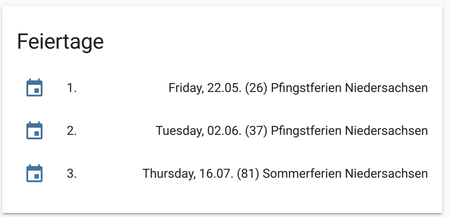
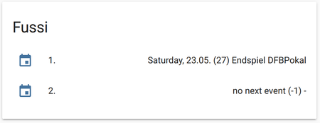
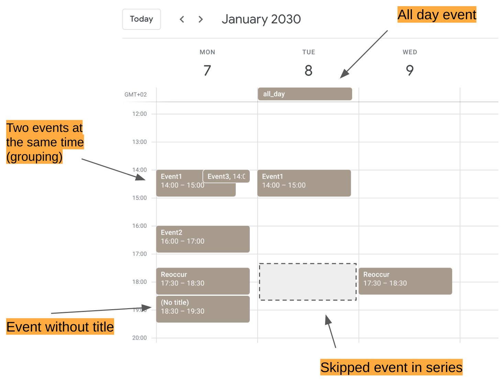
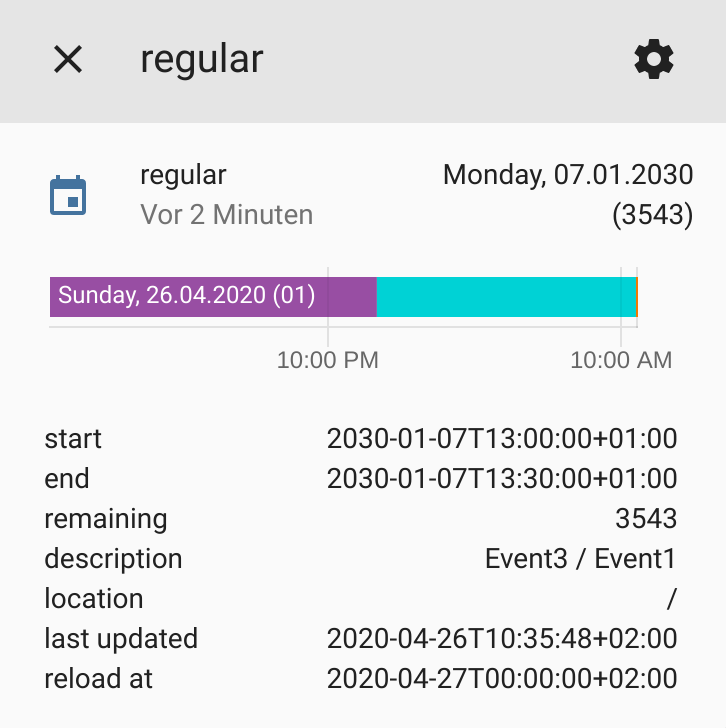

# ICS

Adds a sensor to Home Assistant that displays the date and number of days to the next event. 
E.g. 5 days until the trash will be picked up. The information will be read from a user definded 
ics file.

**This component will set up the following platforms.**

Platform | Description
-- | --
`sensor` | Show date and remaining days to event


## Features

- Supports ICS file (local and online) with reoccuring events
- Events can be filtered, so you can tell it to look only for certain events
- Has attributes that calculated the number of days, so you can easily run a automation trigger, show start / end of the events
- Low CPU and network usage, as it only updates once per day (whenever the date changes) or when the event is over (assuming force reload is disabled)
- If multiple events occure on the same time, all title will be shown, connected with "/"
- Can be configured to look for 'the event after the event'

# Installation

## HACS

The easiest way to add this to your Homeassistant installation is using [HACS]. 

It's recommended to restart Homeassistent directly after the installation without any change to the Configuration. 
Homeassistent will install the dependencies during the next reboot. After that you can add and check the configuration without error messages. 
This is nothing special to this Integration but the same for all custom components.


## Manual

1. Using the tool of choice open the directory (folder) for your HA configuration (where you find `configuration.yaml`).
2. If you do not have a `custom_components` directory (folder) there, you need to create it.
3. In the `custom_components` directory (folder) create a new folder called `ics`.
4. Download _all_ the files from the `custom_components/ics/` directory (folder) in this repository.
5. Place the files you downloaded in the new directory (folder) you created.
6. Follow the instructions under [Configuration](#Configuration) below.

Using your HA configuration directory (folder) as a starting point you should now also have this:

```text
custom_components/ics/.translations/en.json
custom_components/ics/__init__.py
custom_components/ics/manifest.json
custom_components/ics/sensor.py
custom_components/ics/config_flow.py
custom_components/ics/const.py

```

# Setup

All you need to have is a link to a ICS file, e.g. https://www.rmg-gmbh.de/download/Hamb%C3%BChren.ics

## Configuration options

Key | Type | Required | Default | Description
-- | -- | -- | -- | --
`name` | `string` | `true` | `None` |  The friendly name of the sensor
`url` | `string` | `true` | `None` | The url to the ics file usually some weblink, but can also be local file e.g. https://www.rmg-gmbh.de/download/Hamb\%C3%BChren.ics or file:///tmp/test.ics
`id` | `int` | `true` | `None` | A number to identify your sensor later on. e.g. for id=1 the entity will be sensor.ics_1 using id 1 a second will result in sensor.ics_1_2
`timeformat` | `string` | `false` | `"%A, %d.%m.%Y"` | The format that is used to display the date see http://strftime.org/ for more infomation
`lookahead` | `int` | `false` | `365` | The number of days that limits the forecast. E.g. 1 will only show the events of today
`startswith` | `string` | `false` | `""` | A filter that will limit the display of events. E.g. if your file contains multiple entries and you only want to know one type at per sensor, simply create multiple sensors and filter. Have a look at sensor 3 and 4 above. startswith: Bio will ohne show events that start with Bio.
`show_blank` | `string` | `false` | `""` | Indicates whether to show empty events (events without title), and what should be used as title instead. e.g. "Meeting123" would show events with empty title with the string "Meeting123". An empty string (default) or " " will avoid showing blank events.
`force_update` | `int` | `false` | `0` | Force to update the data with given intervall (seconds). This can be useful if the calendar is very dynamic, but pointless for almost static calendars. The calendar will reload at midnight and once the (start/end) of the event is over regardless of this setting. 0 = Disabled
`show_remaining` | `bool` | `false` | `true` | Show the remaining days in the sensor state, close to the date.
`show_ongoing` | `bool` | `false` | `false` | Show events that have already started but not finished.
`group_events` | `bool` | `false` | `true` | Show events with same start date as one event
`n_skip` | `int` | `false` | `0` | Skip the given amount of events, useful to show the appointment AFTER the next appointment
`description_in_state` | `bool` | `false` | `false` | Show the title of the events in the state

## GUI configuration 

As of 2020/04/20 config flow is supported and is the prefered way to setup the integration. (No need to restart Home-Assistant)

## Manual configuration 

To enable the sensor, add the following lines to your `configuration.yaml` file and replace the link accordingly:

```yaml
# Example entry for configuration.yaml
sensor:

  - platform: ics
    name: Packaging
    url: https://www.rmg-gmbh.de/download/Hamb%C3%BChren.ics
    id: 1

  - platform: ics
    name: Trash
    url: http://www.zacelle.de/privatkunden/muellabfuhr/abfuhrtermine/?tx_ckcellextermine_pi1%5Bot%5D=148&tx_ckcellextermine_pi1%5Bics%5D=0&tx_ckcellextermine_pi1%5Bstartingpoint%5D=234&type=3333
    id: 2

  - platform: ics
    name: Trash 2
    url: https://www.ab-peine.de/mcalendar/export_termine.php?menuid=185&area=141&year=2020
    startswith: Rest
    id: 3

  - platform: ics
    name: Bio
    url: https://www.ab-peine.de/mcalendar/export_termine.php?menuid=185&area=141&year=2020
    startswith: Bio
    show_ongoing: true
    id: 4

  - platform: ics
    name: Work
    url: https://calendar.google.com/calendar/ical/xxxxxxxxxxxxxgroup.calendar.google.com/private-xxxxxxxxxxxxxxx/basic.ics
    timeformat: "%d.%m. %H:%M"
    force_update: 600
    show_remaining: false
    id: 5

  - platform: ics
    name: Work today
    url: https://calendar.google.com/calendar/ical/xxxxxxxxxxxxxgroup.calendar.google.com/private-xxxxxxxxxxxxxxx/basic.ics
    timeformat: "%H:%M"
    lookahead: 1
    force_update: 600
    show_remaining: false
    id: 6

  - platform: template
    sensors:
      ics_5_txt:
        value_template: '{{ states.sensor.ics_5.attributes.description}} @ {{states.sensor.ics_5.state}}'
        friendly_name: "Work Next"
      ics_6_txt:
        value_template: '{{ states.sensor.ics_6.attributes.description}} @ {{states.sensor.ics_6.state}}'
        friendly_name: "Work today"


```

# Automation

Example that executes on the day before one of the 'events'

```yaml
automation:
  - alias: 'trash pickup msg'
    initial_state: 'on'
    trigger:
      - platform: time_pattern
        hours: 19
        minutes: 00
        seconds: 00
    condition:
        condition: or
        conditions:
        - condition: template
          value_template: "{{ state_attr('sensor.ics_1', 'remaining') == 1 }}"
        - condition: template
          value_template: "{{ state_attr('sensor.ics_2', 'remaining') == 1 }}"
        - condition: template
          value_template: "{{ state_attr('sensor.ics_3', 'remaining') == 1 }}"
```

and create / send some beautiful messages like this:

```yaml
script:
   seq_trash:
      sequence:
         - service: notify.pb
           data_template:
           title: "Trash pickup tomorrow"
           message: >
              {{states.sensor.ics_1.attributes.friendly_name}} pickup tomorrow.
              {{states.sensor.ics_2.attributes.friendly_name}} pickup tomorrow.
              {{states.sensor.ics_3.attributes.friendly_name}} pickup tomorrow.
```

# Use-cases for skip property
Show the next n-Events. Simply by creating three sensors with `n_skip:0 / n_skip:1 / n_skip:2` <br>
Setting 'description_in_state: True` will also show the title.




Or list the next sport events



# Advance feature
Reoccuring events, events at the same time, skippig events (EXDATE) ... all that can have quite some complexity to it. 



The image above shows my test calendar (year = 2030! thus all lookahead must be >> 365)

## Regular (with grouping)
```yaml
sensor:
- platform: ics
    name: "regular"
    url: https://calendar.google.com/calendar/...
    id: 3
    timeformat: "%A, %d.%m.%Y"
    lookahead: 36500
    startswith: ""
    show_blank: ""
    force_update: 0
    show_remaining: True
    show_ongoing: False
    group_events: True
    n_skip: 0
    description_in_state: False
```
Without advance options (all defaults) we'll get a sensor, showing both event1 and event3 because grouping is enabled (`group_events: True`). 



`Setting group_event: False` would either show event1 or event3 (depends on their order in the ics file)

## Skip 3 next events

```yaml
  - platform: ics
    name: "skip 3, no blank"
    url: https://calendar.google.com/calendar/...
    id: 5
    timeformat: "%d.%m. "
    lookahead: 36500
    startswith: ""
    show_blank: ""
    force_update: 0
    show_remaining: False
    show_ongoing: False
    group_events: True
    n_skip: 3
    description_in_state: True
```
This configuration will show 'allday'. `group_events` will combine the "event1/event3". `show_blank` is not set, so the event without title will be ignored. 

## Skip 3 next events but show blank events
```yaml
- platform: ics
    name: "skip 3, incl blank"
    url: https://calendar.google.com/calendar/...
    id: 6
    timeformat: "%A, %d.%m.%Y"
    lookahead: 36500
    startswith: ""
    show_blank: "Hallo"
    force_update: 0
    show_remaining: False
    show_ongoing: False
    group_events: True
    n_skip: 3
    description_in_state: False
```
Setting `show_blank: 'Hallo'` will add the previous empty event to the list and thus show 'Hallo' instead of 'allday'

## Filter and Skip
```yaml
- platform: ics
    name: "second reoccur"
    url: https://calendar.google.com/calendar/...
    id: 8
    timeformat: "%A, %d.%m.%Y"
    lookahead: 36500
    startswith: "reocc"
    show_blank: ""
    force_update: 0
    show_remaining: True
    show_ongoing: False
    group_events: True
    n_skip: 1
    description_in_state: False
```
This will only look at events that `startswith: 'reocc'`. The first occurance on the 7.1.2030 will be skipped (`n_skip:1`), [the exdate will drop the 8.1.2030] and thus 9.1.2030 will be shown.