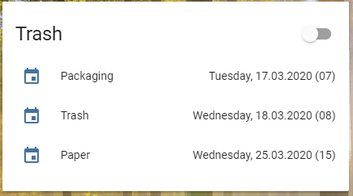

## ICS

Adds a sensor to Home Assistant that displays the date and number of days to the next event. 
E.g. 5 days until the trash will be picked up. The information will be read from a user definded 
ics file.

**This component will set up the following platforms.**

Platform | Description
-- | --
`sensor` | Show date and remaining days to event



### Features

- Supports ICS file with reoccuring events
- Events can be filtered, so you can tell it to look only for certain events
- Has an attribute that calculated the number of days, so you can easily run a automation trigger

## Installation

### HACS

The easiest way to add this to your Homeassistant installation is using [HACS](https://custom-components.github.io/hacs/) and add this repository as a custom repository. And then follow the instructions under [Configuration](#configuration) below.

### Manual

1. Using the tool of choice open the directory (folder) for your HA configuration (where you find `configuration.yaml`).
2. If you do not have a `custom_components` directory (folder) there, you need to create it.
3. In the `custom_components` directory (folder) create a new folder called `ics`.
4. Download _all_ the files from the `custom_components/ics/` directory (folder) in this repository.
5. Place the files you downloaded in the new directory (folder) you created.
6. Follow the instructions under [Configuration](#configuration) below.

Using your HA configuration directory (folder) as a starting point you should now also have this:

```text
custom_components/ics/__init__.py
custom_components/ics/manifest.json
custom_components/ics/sensor.py
```

## Setup

All you need to have is a link to a ICS file, e.g. https://www.rmg-gmbh.de/download/Hamb%C3%BChren.ics

##  Configuration 

To enable the sensor, add the following lines to your `configuration.yaml` file:

```yaml
# Example entry for configuration.yaml
sensor:
  - platform: ics
    name: Packaging
    url: https://www.rmg-gmbh.de/download/Hamb%C3%BChren.ics
    id: 1
  - platform: ics
    name: Trash
    url: http://www.zacelle.de/privatkunden/muellabfuhr/abfuhrtermine/?tx_ckcellextermine_pi1%5Bot%5D=148&tx_ckcellextermine_pi1%5Bics%5D=0&tx_ckcellextermine_pi1%5Bstartingpoint%5D=234&type=3333
    id: 2
  - platform: ics
    name: Trash 2
    url: https://www.ab-peine.de/mcalendar/export_termine.php?menuid=185&area=141&year=2020
    startswith: Rest
    id: 3
  - platform: ics
    name: Trash 3
    url: https://www.ab-peine.de/mcalendar/export_termine.php?menuid=185&area=141&year=2020
    startswith: Bio
    id: 4
```

## Configuration options

Key | Type | Required | Description
-- | -- | -- | --
`name` | `string` | `true` | The name of the sensor
`url` | `string` | `true` | The url to the ics file
`id` | `int` | `false` | A number to identify your sensor later on. e.g. for id=1 the name will be sensor.ical_1
`timeformat` | `string` | `false` | The format that is used to display the date, default is "%A, %d.%m.%Y"
`lookahead` | `int` | `false` | The number of days that limits the forecast. Default 365
`startswith` | `string` | `false` | A filter that will limit the display of events. E.g. if your file contains multiple entries and you only want to know one type at persensor, simply create multiple sensors and filter. Have a look at sensor 3 and 4 above


